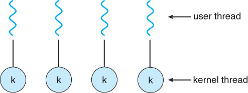
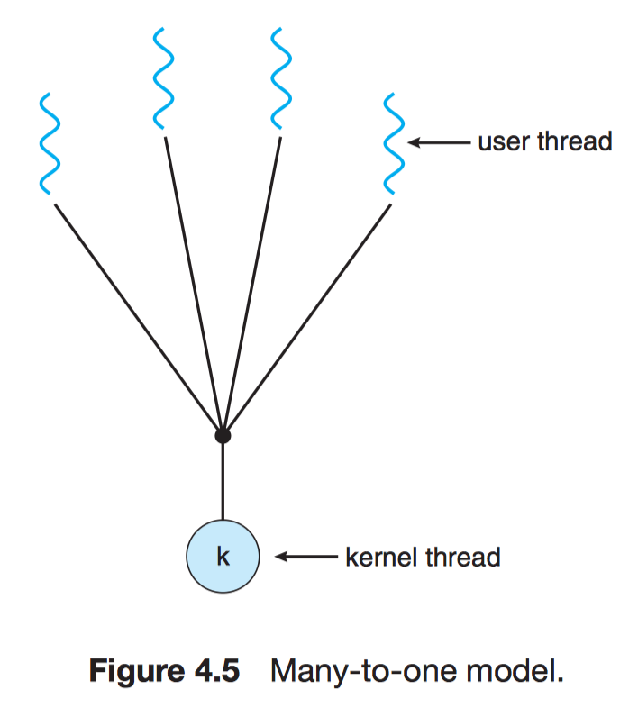

<!-- PROJECT LOGO -->
<br />
  <h3 align="center">ATHREAD - Multithreading C library</h3>
<hr/>

<!-- TABLE OF CONTENTS -->
<details open="open">
  <summary>Table of Contents</summary>
  <ol>
    <li>
      <a href="#about-the-project">About The Project</a>
    </li>
    <li><a href="#building">Building</a></li>
    <li>
      <a href="#using-athread-in-your-project">Using athread in your project</a>
    </li>
    <li><a href="#contribute">Contribute</a></li>
    <li><a href="#authors">Authors</a></li>
  </ol>
</details>

<!-- ABOUT THE PROJECT -->
## About The Project

**athread** is a light weight multithreading library based on one-one and many-one threading model.

There are two types of threads to be managed in a modern system : User threads and Kernel threads. One-One and Many-One Model of threading are specific implementations of mapping the user level threads to kernel level threads.

<ul>
  <li>One-One</li>
  <br>
    <a align="center" href="https://github.com/akanksha6082/multithreading-library">
    
        <br>
    </a>

  <li>Many-One</li>
  <br>
    <a align="center" href="https://github.com/akanksha6082/multithreading-library">
    
    </a>
</ul>

## Building

Execute the following command to build and test ahtread library
```
make run
```
## Using athread in your project

You can use athread in you project by directly copying header and source files from either <a href="https://github.com/akanksha6082/multithreading-library/tree/master/one-one">one-one/</a> or <a href="https://github.com/akanksha6082/multithreading-library/tree/master/many-one">many-one/</a> into your project folder. 

To get you started quickly, let's take a look at how to get a simple Hello World project working.
```
#include <stdio.h>
#include "athread.h"

void Thread_1(void) {
    printf("Hello World!\n");
    mthread_exit(NULL);
}

int main() {
    athread_t tid;
    athread_init();
    athread_create(&tid, NULL, Thread_1, NULL);
    athread_join(tid, NULL);
    return 0;
}
```
## Contribute

Contributions are what make the open source community such an amazing place to be learn, inspire, and create. Any contributions you make are **greatly appreciated**.

1. Fork the Project
2. Create your Feature Branch (`git checkout -b feature/AmazingFeature`)
3. Commit your Changes (`git commit -m 'Add some AmazingFeature'`)
4. Push to the Branch (`git push origin feature/AmazingFeature`)
5. Open a Pull Request


## Authors

* [Akanksha Shah](https://github.com/akanksha6082)


